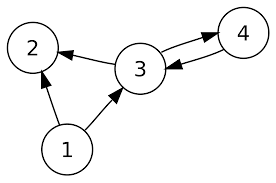

# Python Simple Computational Graph Library
## A python library to construct a directed graph


## Documentation
### Graph object 
```class Graph:```
    Graph object, a network of node objects with 'data' as an attribute, 'data' can be any data type.
### Node object
   ```class Node:``` 
       Creates a node object with the attributes:
#### Attributes for Node object
   * self.data ('data' can be any data type)
  
   * self.parents (list with nodes connected to this node), 
  
   * self.paths (a list with neighbor nodes that are available as a possible node to connect to from this node)
  
   * self.open (a boolean, True if node is open to be searched and visited, False if closed)
  
#### Attributes for Graph object
* self.start (the node at the start of the graph) [Node object]
* self.end (the node at the end of the graph) [Node object]
* self.size (size of graph) [integer]
* self.connections (all connections in the graph; dictionary with a link between two nodes as key and weight of the link as value) [dictionary]
* self.adj (adjacency list; dictionary with Node object as key and paths attribute of Node object as value ) [dictionary]
* self.values (dictionary with data of Node object as key and Node object with that data as value) [dictionary]

#### Methods for Graph object
```python
def switch(self,value):
    """if node is closed this method will open it
    if node is open this method will close it
    :returns True
    """
def link_two_nodes(self, value_1, value_2, weight=0):
    """creates a link from node corresponding to value_1 and node corresponding to value_2
        if graph has no links, first node will become start of graph
        the last added node will become the end of the graph.
        :param value_1: data of first node
        :param value_2: data of the destination node
        :param weight: weight of path
        :return: the link between node_1 and node_2
    """
def remove_node(self, value):
    """ 
    :param value: data of node
    :return: Removes node from graph and returns that same node and removes all connections to node
    """
def clear_graph(self):
    """ Resets the graph.
    """
def display_nodes(self):
    """ 
    :return: string with all paths of the graph, together with the weight of the path
    """
def number_of_paths(self):
    """ 
    :return: number of paths in graph
    """
def size_of_graph(self):
    """ 
    :return: number of nodes in graph
    """
def dfs(self, start):
    """
    Dfs-search the graph
    :param start: the node in which the dfs search will start
    :return: list of all the nodes in graph, in dfs order, dfs search is done with stack calls.
    """
def bfs(self, start):
    """
    Bfs-search the graph 
    :param start: the data of node in which the bfs search will start
    :return: list of all the nodes in graph, in bfs order.
    """
def find_path(self, start, end, search='dfs'):
    """
    This method returns a list with nodes visited to get from the start node to the end node. 
    Dfs-search path is set as default. If path is not found the method returns None.
    :param start: the node in which the path search will start.
    :param end: the node in which the path search will end.
    :param search: specifies what type of search will be used to find the path. 'dfs' and 'bfs' are alternatives.
    :return: list of nodes visited, giving the path from start to end node.
    """
```
## Roadmap
* The API of the library is frozen
* Version numbers adhere to semantic versioning

The only accepted reason to modify the API of this package is to handle issues that can't be resolved in any other reasonable way.
## Usage
```python
from graphlib import Graph
from random import getrandbits

graph = Graph()
"""
Construct a maze where '1' will become the start and '9' will become the end of the maze. 
7 8 9
4 5 6
1 2 3
"""
# This will construct the graph by linking the the nodes, the weight of each link is set to zero as default.
# In particular the first line will create a link between two nodes, a link from one with data int(1) to the other with data int(2).
graph.link_two_nodes(1, 2)
graph.link_two_nodes(1, 4)
graph.link_two_nodes(2, 1)
graph.link_two_nodes(2, 3)
graph.link_two_nodes(2, 5)
graph.link_two_nodes(3, 2)
graph.link_two_nodes(3, 6)
graph.link_two_nodes(4, 1)
graph.link_two_nodes(4, 5)
graph.link_two_nodes(4, 7)
graph.link_two_nodes(5, 2)
graph.link_two_nodes(5, 4)
graph.link_two_nodes(5, 6)
graph.link_two_nodes(5, 8)
graph.link_two_nodes(6, 3)
graph.link_two_nodes(6, 5)
graph.link_two_nodes(6, 9)
graph.link_two_nodes(7, 4)
graph.link_two_nodes(7, 8)
graph.link_two_nodes(8, 5)
graph.link_two_nodes(8, 7)
graph.link_two_nodes(8, 9)
graph.link_two_nodes(9, 6)
graph.link_two_nodes(9, 8)

def create_maze(g):
    """A function that can generate a random maze by closing some of the nodes in the graph, making them walls.
    :param g: graph
    :return: a list of all nodes in graph that are open
    """
    maze = []
    for i in g.adj.keys():
        random_bit = getrandbits(1)
        random_boolean = bool(random_bit)
        if random_boolean:
            g.switch(i.data)
        else:
            maze.append(i.data)
    return maze
# This will make a dfs search of the graph, starting at node with data 1.
graph.dfs(1)
# This will make a bfs search of the graph, starting at node with data 1.
graph.bfs(1)
# This will find a path from node with data 1 to node with data 9 using dfs search algorithm
graph.find_path(1,9)
# This will find a path from node with data 1 to node with data 9 using bfs search algoritm, this is also the shortest path
graph.find_path(1,9, 'bfs')


```

Leandro Carocca
